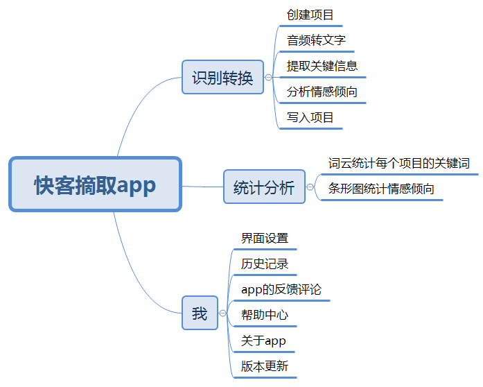

## 快客app产品需求文档
#### 1. 市场需求与竞品分析
##### 需求：
根据鲸准研究院做出的2018.05的中国智能客服行业研究报告中提出，中国大约有500万全职客服来应对顾客的咨询需求，并且随着互联网持续为市场经济发展注入活力，咨询业务的需求将越来越多，特别是在金融、教育、电商行业，所以现在涌现出小i机器人、网易七鱼、腾讯企点等一批智能客服厂商利用NLP,深度学习等技术来提高对话服务的工作效率。可见与顾客交谈所产生的数据价值是巨大的，可以根据交谈内容来获取顾客的情感倾向和关键反馈信息，将会为产品带来改进意见，为以用户为中心的设计提供指导。
##### 分析:
现在市场上的智能客服主要的价值主张是取代人工客服，实现高效地跟顾客进行沟通，为企业减少人力、物力成本。与快客app的价值主张不同，我们在于从谈话内容中快速提取对方的谈话重点与情感倾向，为运营商改进产品设计提供参考意见。  
再纵观现在的Saas（软件即服务）市场，还缺乏音频转文本，从文本中提取关键信息和情感态度、可视化反馈结果的三项功能集成的Saas产品。更多的是仅提供其中上述一项的Paas（平台即服务）产品

#### 2. 用户概述
   1. 受众群体  
   通过电话沟通快速提取对方的谈话重点以及情感倾向的用户，特别是每天需要应对许多顾客的客服。
   2. 用户痛点
      1. 在与对方电话沟通的过程中，大部分注意力用于思考答复对方的内容，没有过多的精力去记忆对方的讲话内容，容易导致一些关键信息的遗漏。
      2. 对于企业的客服而言，每天都需要与很多顾客进行沟通，可以通过收集每次顾客与客服谈话的关键信息与情感倾向，就能挖掘出谈话信息的价值，更有针对性的改进产品的功能服务，满足用户需求。
   3. 需求列表
      1. 将谈话内容转化为文本
      2. 通过文本分析出情感倾向、关键信息
      3. 统计关键信息和情感倾向的数据，为用户理解对方的想法、动机提供可视化的建议
#### 3. 产品介绍
   1. 价值主张
   从谈话内容中快速提取对方的谈话重点与情感倾向
   2. 痛点解决办法
      主要功能都是调取百度AI开放平台的语音技术与自然语言处理技术的API来实现，使用[音频文件转写API](https://ai.baidu.com/ai-doc/ITMA/Qk38ikh93)实现音频转换为文本；使用[评论观点抽取API](https://ai.baidu.com/tech/nlp_apply/comment_tag)提取文本中的关键信息，再使用[情感倾向分析](https://ai.baidu.com/tech/nlp_apply/sentiment_classify)判断对方的情感态度，可用于做数据统计。
   3. 功能与服务
      1. 批量读取模式或者手动读取模式，批量读取模式需要用户授权给app录音，每当打完电话后就会自动生成音频文件用于统计分析。如果是手动模式的话，就需要用户自己上传音频文件。
      2. 转换成文本后，让用户确认文本内容是否正确，确认无误后就开始提取关键信息，如果用户确认所提取的关键信息无误，就分析情感倾向。
      3. 用户可以选择关键信息呈现的形式（词云、条形图等），也可以选择情感倾向的数据统计区间分组。
      4. 为保护用户隐私，谈话记录只能储存在客户端，用户可以根据日期、对象、关键词、情感倾向来查看谈话记录。
#### 4. 产品原型
   1. 产品架构
  

   2. axure原型（低保真）
   [快客app_prototype](https://voeth.github.io/API_ML_AI/快客app_prototype/)  
   
   3. 代码示例
   [快客app%20集成百度智能云api开发代码示例](https://voeth.github.io/API_ML_AI/sources/%E5%BF%AB%E5%AE%A2app%20%E9%9B%86%E6%88%90%E7%99%BE%E5%BA%A6%E6%99%BA%E8%83%BD%E4%BA%91api%E5%BC%80%E5%8F%91%E4%BB%A3%E7%A0%81%E7%A4%BA%E4%BE%8B)  
#### 5. 产品运营与盈利
