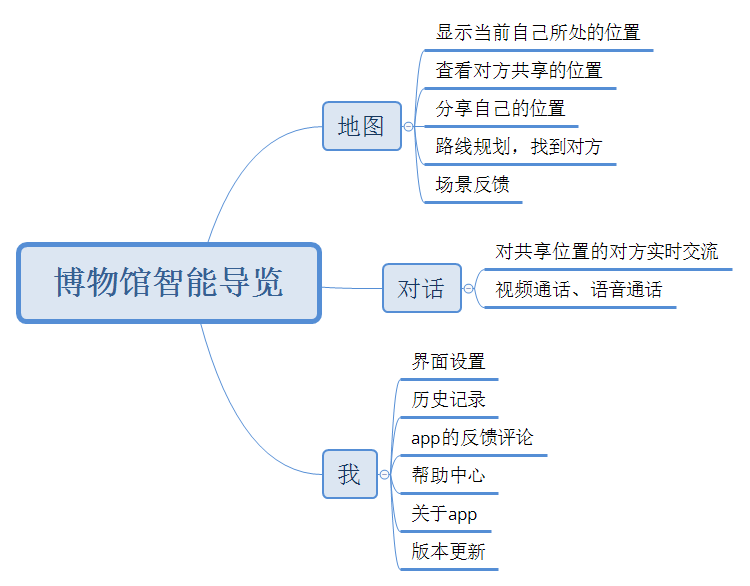

## 目录
* [客户细分](#客户细分)
  - [目标用户](#目标用户)
  - [用户痛点/增长点/任务](#用户痛点/增长点/任务)
  - [需求列表](#需求列表)
* [产品介绍](#产品介绍)
  - [加值宣言](#加值宣言)
  - [MVP核心价值](#MVP核心价值)
  - [人工智能概率性](#人工智能概率性)
  - [原型2信息设计](#原型2信息设计)
  - [原型1交互及界面设计+原型3原型文档](#原型1交互及界面设计+原型3原型文档)
  - [原型4.说明](#原型4.说明)
  - [API调试结果](#API调试结果)
## 客户细分
#### 目标用户
带多动症孩子去参观博物馆的家长、带行动不便但又能借助辅助工具行走的患者的看护人员。
#### 用户痛点/增长点/任务
多动症孩子喜欢到处乱跑，家长有时难以跟上孩子的速度，容易把孩子跟丢。看护人员需要时刻陪伴在患者身边，不能做自己想做的事情。
#### 需求列表
家长：孩子跟丢了，只能打电话给孩子或者请广播站的工作人员通报情况。  
看护人员：时刻跟随在患者身边。
## 产品介绍

#### 加值宣言
1. 调用[高德开放平台的室内地图api](https://lbs.amap.com/getting-started/indoorintro/)，完成在app、网页对博物馆室内地图进行渲染，实现室内路线规划的功能。
2. 调用高德开放平台的定位api，实现博物馆室内十米以内精度定位，毫秒级响应。实时将孩子或患者在博物馆的具体位置反馈给家长或看护人员。家长或
看护人员就可以根据定位快速找到他们。看护人员只需要在患者遇到楼梯、斜坡等非水平、不平整路面的时候才去帮忙；家长可以坐下来休息，通过手机
就可以知道孩子现在跑去了哪个地方。
3. 调用[阿里云的视频内容分析](https://promotion.aliyun.com/ntms/act/video-content-create.html?spm=a2c4g.11174283.1kquk9v2l.1.167d1039kBpxwP&wh_ttid=pc#/contentStructure)，通过摄像头识别孩子或患者身边所遇到的物体。
#### MVP核心价值
精准定位、共享双方在博物馆室内的位置，快速找到对方
#### 人工智能概率性
1. 使用高德地图定位API和室内地图API来定位，只要博物馆内网络信号比较良好且高德地图的技术也相当成熟，所以定位和路线规划的精确度可以保证
2. 阿里云的视频内容分析API,通过摄像头识别身边物体，然后判断身边环境的危险性这个还比较难做出精准判断。基于安全性考虑，提高对危险判断的敏感度，提醒家长和看护人员调取孩子或行动不便者的摄像头来观察其所处环境，克服视频内容分析API的概率性误差和不确定性。
#### 原型2信息设计
（如果显示不出图和头像，那就是网络连接的问题。建议您使用有线上网或者VPN代理，请见谅！）:disappointed_relieved: 
* 产品架构

1. 获取地理位置，用户打开wifi、蓝牙、GPS，确保app可以获取用户在博物馆的实时位置。
2. 位置共享，将所处的位置以链接、二维码的形式发给他人，增加密钥、口令等验证方式来保证信息安全。
3. 路线规划，需要会合的时候，为用户规划室内路线。
4. 警报功能，由用户选择发起警报的情况（比如对方遇到楼梯发出警报、走出场馆发出警报等），让用户不必时刻盯着手机。
5. 场景反馈功能，如果用户授权调取摄像头，就可以通过摄像头和阿里云的图像识别服务api，反馈对方周围的物体。
6. 对话功能，共享位置的双方还可以通过app实时通讯。
#### 原型1交互及界面设计+原型3原型文档
https://voeth.github.io/API_ML_AI/博物馆智能导览_prototype/
#### 原型4.说明
本产品主要是基于室内精准定位来判断多动症孩子和行动不便的老人是否需要帮助，当遇到楼梯、斜坡；被检测对象要走出室内时，就会自动发出提醒，这样就不需要家长或看护人员时刻陪在他们身边，可以暂时去做自己想做的事情，还可以开启路线规划找到对方。也结合了视频内容分析API来检测被检测者是否遇到了困难，当然这个产品仅适用于室内的应用场景。
#### API调试成果
https://voeth.github.io/API_ML_AI/sources/amap_api.html
