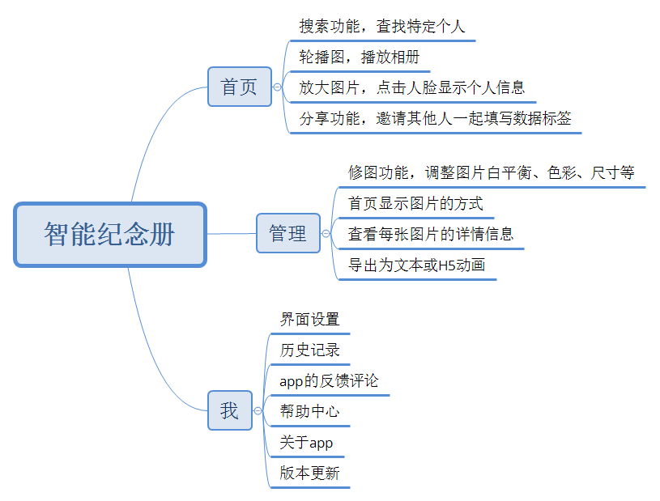
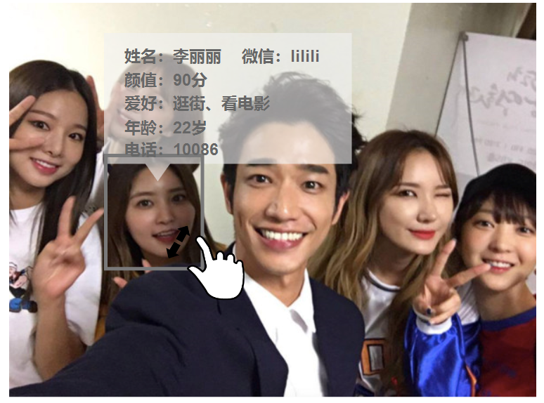

## 目录（依据商业画布来写）
* [客户细分](#客户细分)
  - [目标用户](#目标用户)
  - [用户痛点/增长点/任务](#用户痛点/增长点/任务)
  - [需求列表](#需求列表)
* 产品介绍
  - [加值宣言](#加值宣言)
  - [MVP核心价值](#MVP核心价值)
  - [原型展示](#原型展示)
  - [产品与服务](#产品与服务)
  - [人工智能概率性](#人工智能概率性)
                                           
## 客户细分
#### 目标用户
即将毕业且仍希望与同学、朋友在以后保持联系的毕业生
#### 用户痛点/增长点/任务
我们通常都是通过手机通讯录、各种社交软件来保存同学、好友的联系方式，虽然仍然可以联系，但
是难以保存每个人具体的属性特征乃至长相的信息，日后忘记了好友曾经长什么样子，碰面了也不能认出对方。
#### 需求列表
使用微信、qq添加好友并添加备注或者使用手机通讯录保存电话号码

## 产品介绍
#### 加值宣言
基于大合照来管理照片上每个人的具体信息，通过调取[azure的人脸识别](https://www.azure.cn/zh-cn/home/features/cognitive-services/face)api
实现对合照的人脸进行面部识别、统计总人数和男女人数、分析生物属性。通过用户提供的数据标记，来标识和存储每个人的具体信息，用户可拉大合照，点击脸部
即可查询详细个人信息，轻松而全面地管理通讯录。
#### MVP核心价值
通过合照轻松管理好友通讯录，只要点击合照上的人脸即可查看其个人详细信息，还能智能评测出每个人的生物属性（比如说年龄、颜值等）

#### 原型展示
（如果显示不出图和头像，那就是网络连接的问题。建议您使用有线上网或者VPN代理，请见谅！）:disappointed_relieved: 

#### 产品与服务
1. 搜索引擎，用户输入名字或者其它关键词可查询并返回关于合照中人物的搜索结果。
2. 分享功能，可以将合照与网页分享至微信群聊或qq群聊中，让其它好友输入个人信息。也可以美化了合照之后，发到朋友圈上。
3. 人脸统计与分析，统计合照当中的总人数和男女数量，分析每个人的颜值、年龄、性别等属性。
4. 修图功能，对合照进行剪裁、调色、抠图、滤镜等美化功能。

#### 人工智能概率性
我们使用azure人脸识别API主要用来做颜值评分，不仅这方面的技术也相当成熟了，市面上的各大互联网企业的人脸识别都可以做到较好的效果，而且颜值评分只要不是偏差太大，用户是不会在意的，有点误差用户可能还会觉得这个app很有趣，所以人脸识别的概率性不必担心。
